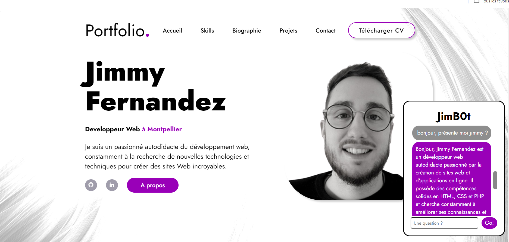

# Portfolio_and_Chatbot
Ce projet est une application web déployée sur Microsoft Azure qui combine un portfolio personnel avec un chatbot intégré. Le chatbot est conçu pour répondre aux questions des utilisateurs en fonction des informations contenues dans le portfolio.

## Capture d'écran de l'interface utilisateur



## Fonctionnalités
Portfolio personnel : Mes réalisations, projets, compétences et expériences professionnelles.

Chatbot intégré : Posez des questions sur le contenu du portfolio et obtenez des réponses pertinentes en temps réel.

## Déploiement
Pour exécuter le code, assurez-vous de remplacer les valeurs des clés Azure dans le fichier de configuration approprié. Suivez les instructions dans le fichier `azur-connect.yml` pour configurer le pipeline CI/CD et déployer l'application sur Azure. 

## Utilisation 
Pour faire fonctionner le code, il vaut remplacer vos 3 clef avec Azure : 
`AZURE_CREDENTIALS` : les informations d'identification pour la connexion à Azure.
`REGISTRY_PASSWORD` : le mot de passe requis pour accéder à votre registre Azure Container.
`AZURE_OPENAI_KEY` : la clé d'API OpenAI utilisée pour le chatbot.

## Arborescence du projet 

```bash
Portfolio_and_Chatbot/      
│
├── .github/
│   └── workflows/
│       └── azur-connect.yml
│
├── back/
│   └── fastapi_chat.py
│
├── front/
│   ├── Css/ styles.css
│   ├── img/ *.png
│   ├── Dockerfile
│   └── js/ chat.js, script.js
│
├── test/
│   └── tests_unit.py
│
├── .gitignore
├── deploy-aci.yaml
├── Dockerfile
├── README.md
└── requirements.txt
```

